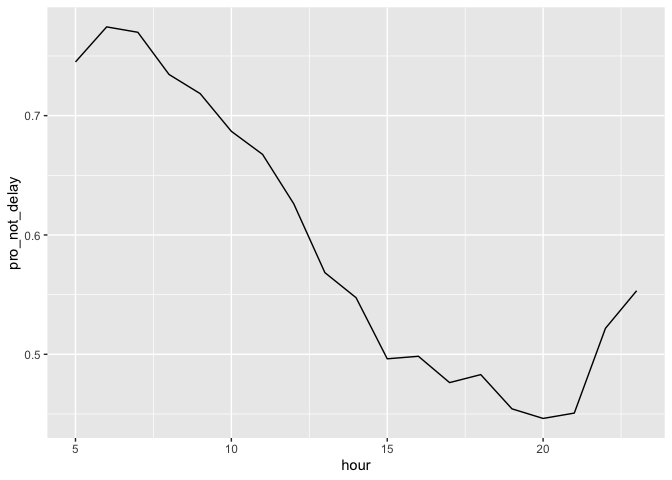

README
================
Annabelle Wan
10/5/2021

``` r
# Our task is to find if the time of day, carrier, departure airport, and season will influence the flights' delay based on flights data provided.
# Conclusion: Finally, we can conclude that among the factors of the time of day, carrier, departure airport, and season, we can say that only the time of day will influence the flights' delay most. Other factors have the influence, but they do not have large influence as the time of day does.
library(dplyr)
```

    ## 
    ## Attaching package: 'dplyr'

    ## The following objects are masked from 'package:stats':
    ## 
    ##     filter, lag

    ## The following objects are masked from 'package:base':
    ## 
    ##     intersect, setdiff, setequal, union

``` r
library(nycflights13)
library(tidyverse)
```

    ## ── Attaching packages ─────────────────────────────────────── tidyverse 1.3.1 ──

    ## ✓ ggplot2 3.3.5     ✓ purrr   0.3.4
    ## ✓ tibble  3.1.4     ✓ stringr 1.4.0
    ## ✓ tidyr   1.1.3     ✓ forcats 0.5.1
    ## ✓ readr   2.0.1

    ## ── Conflicts ────────────────────────────────────────── tidyverse_conflicts() ──
    ## x dplyr::filter() masks stats::filter()
    ## x dplyr::lag()    masks stats::lag()

``` r
library(ggplot2)
```

``` r
filter(flights, !dep_delay>0)
```

    ## # A tibble: 200,089 × 19
    ##     year month   day dep_time sched_dep_time dep_delay arr_time sched_arr_time
    ##    <int> <int> <int>    <int>          <int>     <dbl>    <int>          <int>
    ##  1  2013     1     1      544            545        -1     1004           1022
    ##  2  2013     1     1      554            600        -6      812            837
    ##  3  2013     1     1      554            558        -4      740            728
    ##  4  2013     1     1      555            600        -5      913            854
    ##  5  2013     1     1      557            600        -3      709            723
    ##  6  2013     1     1      557            600        -3      838            846
    ##  7  2013     1     1      558            600        -2      753            745
    ##  8  2013     1     1      558            600        -2      849            851
    ##  9  2013     1     1      558            600        -2      853            856
    ## 10  2013     1     1      558            600        -2      924            917
    ## # … with 200,079 more rows, and 11 more variables: arr_delay <dbl>,
    ## #   carrier <chr>, flight <int>, tailnum <chr>, origin <chr>, dest <chr>,
    ## #   air_time <dbl>, distance <dbl>, hour <dbl>, minute <dbl>, time_hour <dttm>

``` r
#Following chunk will show us if the time of day will influence the flights' delay. 
time_of_day <- flights %>% 
  group_by(hour) %>% 
  summarize(pro_not_delay=sum(!dep_delay>0, na.rm=TRUE)/n(),
            num_not_delay=sum(!dep_delay>0, na.rm=TRUE))
time_of_day=time_of_day[-1,]
time_of_day
```

    ## # A tibble: 19 × 3
    ##     hour pro_not_delay num_not_delay
    ##    <dbl>         <dbl>         <int>
    ##  1     5         0.745          1455
    ##  2     6         0.774         20096
    ##  3     7         0.770         17569
    ##  4     8         0.735         20010
    ##  5     9         0.718         14593
    ##  6    10         0.687         11476
    ##  7    11         0.668         10703
    ##  8    12         0.626         11385
    ##  9    13         0.568         11344
    ## 10    14         0.547         11883
    ## 11    15         0.496         11854
    ## 12    16         0.498         11463
    ## 13    17         0.476         11634
    ## 14    18         0.483         10521
    ## 15    19         0.454          9741
    ## 16    20         0.446          7470
    ## 17    21         0.451          4928
    ## 18    22         0.522          1377
    ## 19    23         0.553           587

``` r
ggplot(time_of_day, mapping = aes(x=hour, y=pro_not_delay))+
  geom_line()
```

<!-- -->

``` r
# People would like to take a flight in the morning if they want to avoid delays as much as possible since in the morning, especially between 5am-9 am, people have high chance to depart on time (over than 60% chance in the morning, and this chance could over 70% if people leave between 5am-9 am).
```

``` r
#Following chunk will show us if the carrier will influence the flights' delay. 
carrier_reason<- flights %>% 
  group_by(carrier) %>% 
  summarize(num_not_delay=sum(!dep_delay>0, na.rm=TRUE),
            pro_not_delay=sum(!dep_delay>0, na.rm=TRUE)/n()) %>% 
  arrange(desc(pro_not_delay))
carrier_reason
```

    ## # A tibble: 16 × 3
    ##    carrier num_not_delay pro_not_delay
    ##    <chr>           <int>         <dbl>
    ##  1 HA                273         0.798
    ##  2 US              15098         0.735
    ##  3 AS                486         0.681
    ##  4 DL              32520         0.676
    ##  5 AA              21931         0.670
    ##  6 MQ              17132         0.649
    ##  7 OO                 20         0.625
    ##  8 B6              32724         0.599
    ##  9 VX               2906         0.563
    ## 10 9E              10353         0.561
    ## 11 UA              30718         0.524
    ## 12 EV              28217         0.521
    ## 13 YV                312         0.519
    ## 14 F9                341         0.498
    ## 15 FL               1533         0.470
    ## 16 WN               5525         0.450

``` r
ggplot(carrier_reason, aes(x=carrier, y=pro_not_delay)) + 
  geom_bar(stat="identity")
```

<!-- -->

``` r
# The time of day should fly if I want to avoid delays does not really depend on carriers. Almost all of carriers have more than 50% chance to depart on time. And the difference of departure on time among carriers is not significant.
```

``` r
#Following chunk will show us if the departure airport will influence the flights' delay. 
origin_reason<- flights %>% 
  group_by(origin) %>% 
  summarize(num_not_delay=sum(!dep_delay>0, na.rm=TRUE),
            pro_not_delay=sum(!dep_delay>0, na.rm=TRUE)/n()) %>% 
  arrange(desc(pro_not_delay))
origin_reason
```

    ## # A tibble: 3 × 3
    ##   origin num_not_delay pro_not_delay
    ##   <chr>          <int>         <dbl>
    ## 1 LGA            67819         0.648
    ## 2 JFK            67385         0.606
    ## 3 EWR            64885         0.537

``` r
bp<- ggplot(origin_reason, aes(x="", y=pro_not_delay, fill=origin))+
  geom_bar(width = 1, stat = "identity")
pie_origin <- bp + coord_polar("y", start=0)
pie_origin
```

<!-- -->

``` r
# The time of day should fly if I want to avoid delays not really depend on origin place to fly. Different origins has very small different proportions and numbers of flights that not delay.
```

``` r
#Following chunk will show us if the season will influence the flights' delay. 
nm1 <- setNames(rep(c("Winter", "Spring", "Summer", "Fall"),
        each = 3), month.name)
season_reason<-flights %>% 
  mutate(season = nm1[month]) %>% 
  group_by(season) %>% 
  summarize(pro_not_delay=sum(!dep_delay>0, na.rm=TRUE)/n(),
            num_not_delay=sum(!dep_delay>0, na.rm=TRUE))
season_reason
```

    ## # A tibble: 4 × 3
    ##   season pro_not_delay num_not_delay
    ##   <chr>          <dbl>         <int>
    ## 1 Fall           0.620         52287
    ## 2 Spring         0.570         48640
    ## 3 Summer         0.591         51011
    ## 4 Winter         0.596         48151

``` r
ggplot(season_reason, mapping=aes(x=season, y=pro_not_delay))+
  geom_bar(stat="identity")
```

<!-- -->

``` r
#The time of day should fly if I want to avoid delays does not depend on season. Different seasons has around 2% different proportions among each other.
```
